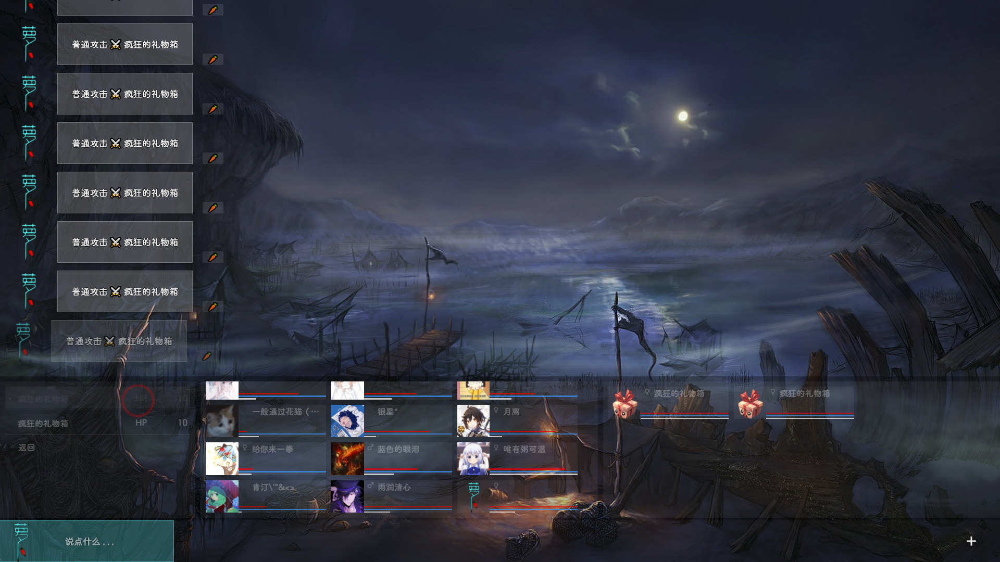
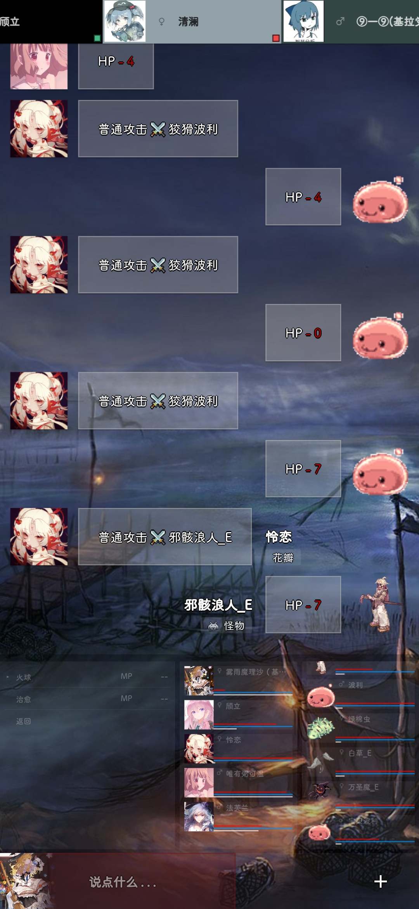
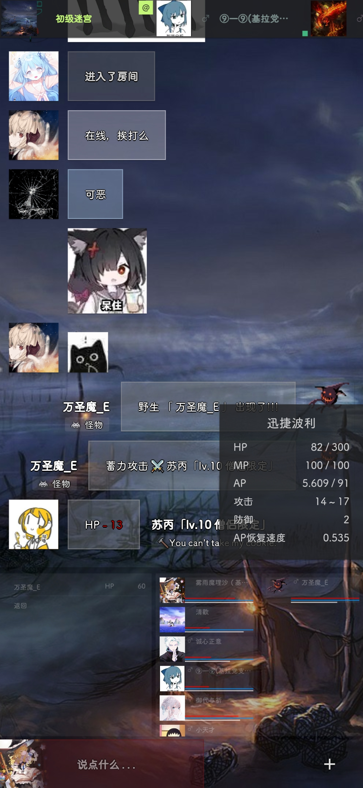
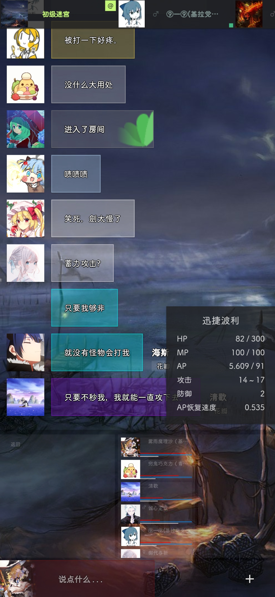
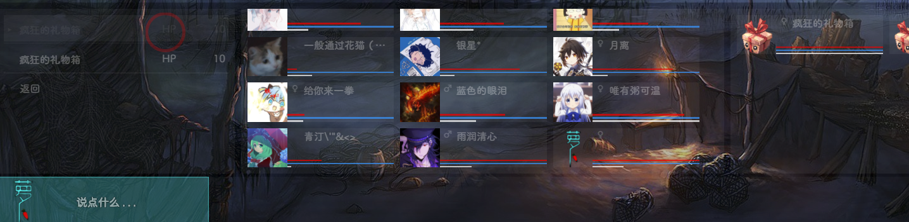

# 初级迷宫

## 写在开头

- 感谢 `雾雨魔理沙（基拉党支部书记）` 和 `萝卜` 提供的截图
- 进入之前请务必叫上一大批人来一起打
- 如果一个人打迷宫可能会迷宫看都没看到就被打死然后被踢出房间
- 迷宫的位置是 根->社区->蔷薇外界->初级迷宫
- 由于一个人进迷宫死的太快了，压根没法截图，所以本章节的截图需要补充一下

## 如何进入

- 首先前往 `侧边栏->消费->商店->游戏->初级迷宫入场券` 中花100蔷薇币购买门票
- 然后叫上你的人前往 根->社区->蔷薇外界 集合
- 人到齐之后一起冲进去就行

## 咋玩啊

### 基本操作

PC端进去之后大概长这样

手机端进去之后大概长这样

底部面板从左向右依次是 `操作面板`、`队友和自己信息`、`怪物的信息`

#### 攻击

> 注：本节缺少截图

在底部操作面板点击 `攻击->(选择攻击方式)->(选择目标)`

这里推荐使用自动攻击，自动攻击会自动选择目标并进行普通攻击操作，这样收益也是最高的

### 收益计算

> 注：本节内容仅供参考，不代表花园的实际情况

- 收益计算目测是通过造成的伤害进行计算的
- 每种类型的怪物都有独立的收益值

### 回血

- 点击 `侧边栏->消费->商店->游戏->加满HP` 即可恢满HP值

### HP/MP/AP

> 注：本节内容仅供参考，不代表花园的实际情况

- 目前好像只有HP有实际作用，其他两个并没有什么用
