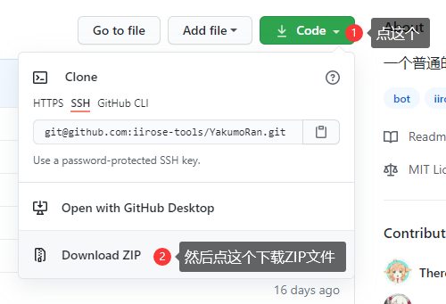
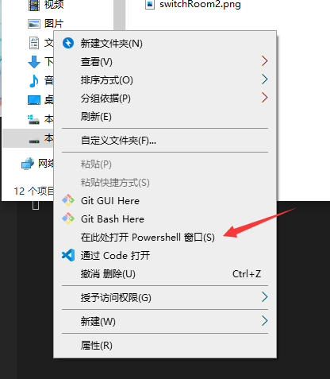

# YakumoRan花园机器人

## 写在开头

- 在使用前请先准备一个机器人账号，然后找Ruby申请机器人认证
- 启动后在房间内发送 .help 查看完整帮助信息
- 本教程面向没有任何基础的萌新，如果你已经有编程基础可以直接查看YakumoRan中的教程

## 名词解释

### uid

花园唯一标识符，例如我的是 `5b0432f77047f`，记得转换成小写，大写可能会出现一些奇奇怪怪的问题

## 部署教程

### 0x00 安装Nodejs

前往 [http://nodejs.cn/download/](http://nodejs.cn/download/) 下载最新版本的nodejs安装包并安装它

### 0x01 下载程序

前往 [GitHub](https://github.com/iirose-tools/YakumoRan) 下载main分支的最新代码

下载好之后找个文件夹解压它，例如解压到 `D:/YakumoRan` 中

### 0x02 安装依赖

按住Shift，在文件夹内点击右键，点击`打开PowerShell`，如下图所示

这个时候你就会看到一个蓝色背景白色文字的窗口，这个时候就可以开始输入命令了

首先输入 `npm install` 安装依赖，如果出现了红色的 `ERR: xxx` 就代表安装失败了，这个时候你可以尝试去联系dalao们

### 0x03 构建代码

还是在上一步的PowerShell中，输入 `npm build`

### 0x04 第一次运行

输入 `npm start` 就可以了，这个时候它应该会告诉你配置文件新建成功了，需要手动修改配置文件然后再次运行

这个时候就可以打开config.json文件了，随便用什么文本编辑器打开都行，当然这里还是推荐使用`vscode`，因为它能告诉你有没有出错，如果出错了就会用红色标记出来

按照配置文件内的提示修改完成后就可以进行下一步了

### 0x05 正式运行

再次输入 `npm start`，如果你上面的操作都没出问题，那么这一步就会非常顺利，你会看到机器人进入了你指定的房间

### 0x06 最后的最后

- 求求了，给个star吧
- 如果没有GitHub账号就算了
